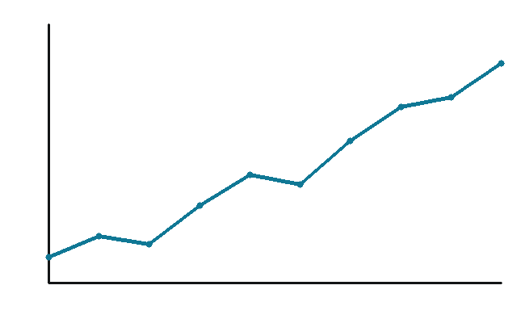

# clean-beamer

[](https://github.com/andrerecio/clean-beamer/actions/workflows/build.yml)
[](LICENSE)
[](demo.pdf)

A minimalist Beamer theme — a LaTeX port of the Typst
[`touying-quarto-clean`](https://typst.app/universe/package/touying-quarto-clean/)
slide theme (itself based on Grant McDermott's *Clean* theme for Quarto +
Reveal.js).



See the rendered result in **[`demo.pdf`](demo.pdf)** — committed to the repo so
you can preview the look without building anything.

## Use

Put `beamerthemeClean.sty` next to your `.tex` file and:

```latex
\documentclass[aspectratio=169]{beamer}
\usepackage[sfdefault, light]{roboto}
\usepackage[scaled]{FiraMono}
\usetheme{Clean}
```

See [`demo.tex`](demo.tex) for a full, self-contained example.

## Features

- **Left-aligned frame titles** with an optional italic, primary-coloured
  subtitle (`\framesubtitle`).
- **List markers** in the primary accent: level 1 filled triangle, level 2
  arrow, level 3 dot; enumerate nesting `1.` / `i.` / `a.`.
- **Slide counter** `x / y` in the bottom-right footer.
- **Automatic section slides** — every `\section{...}` produces a large
  primary-coloured section page (via `\AtBeginSection`).
- `\alert{...}` uses the secondary accent colour; `\textcolor{cleanPrimary}{...}`
  (and `cleanSecondary`, `cleanJet`) are available for inline colour.
- A richer **title page** with an authors grid — see below.

### Author grid with ORCID

Instead of `\author`, you can list authors with optional ORCID, email and
affiliation. Each call adds one cell; the title page lays them out in up to three
columns:

```latex
\cleanauthor{Your Name}{0009-0007-1967-8304}{you@inst.edu}{Your Institution}
\cleanauthor{Coauthor}{}{coauthor@other.edu}{Other Institution}
```

Any of the ORCID / email / affiliation arguments may be left empty (`{}`). If no
`\cleanauthor` is given, the title page falls back to plain `\author` /
`\institute`.

## Citations

The demo uses [`biblatex-chicago`](https://ctan.org/pkg/biblatex-chicago) with the
`biber` backend for true Chicago author–date references:

```latex
\usepackage[authordate, backend=biber, natbib=true]{biblatex-chicago}
\addbibresource{references.bib}
```

`natbib=true` exposes the familiar `\citet` / `\citep` commands **alongside**
biblatex's native `\textcite` / `\parencite`, so all four work:

| command                | renders                            |
|------------------------|------------------------------------|
| `\citet{key}`          | Callaway and Sant'Anna (2021)      |
| `\citep{key}`          | (Callaway and Sant'Anna 2021)      |
| `\textcite{key}`       | Callaway and Sant'Anna (2021)      |
| `\parencite{key}`      | (Callaway and Sant'Anna 2021)      |

biber runs automatically under `latexmk` in CI. Print the bibliography with
`\printbibliography`.

## Figures

Drop a `.png` or `.pdf` next to your `.tex` and include it the usual way — both
raster and vector figures work under pdflatex, and captions are styled to match
the theme (small, primary-coloured label):

```latex
\begin{figure}
  \includegraphics[width=\linewidth]{figures/example-plot.png}
  \caption{A raster .png plot.}
\end{figure}
```

The `figures/` directory holds the two examples used by the demo
(`example-plot.png`, `example-diagram.pdf`), generated by the stdlib-only
`figures/make_figures.py`.

## Fonts & engine

The baseline uses **pdflatex** with the `roboto` and `FiraMono` packages, which
bundle the fonts inside TeX Live — no system-font install, reliable in CI. Body
and headings are Roboto Light; code is Fira Mono.

**Optional LuaLaTeX route** (for true *Fira Code* with ligatures): switch to
LuaLaTeX and use `fontspec`:

```latex
\usepackage{fontspec}
\setmonofont{Fira Code}
```

This needs the font available on the build machine (Fira Code is not guaranteed
to be in TeX Live, so vendor the `.ttf`s or install them on the runner) and the
workflow set to `latexmk_use_lualatex: true`. The pdflatex baseline avoids all of
that, which is why it's the default.

## Building

This repo does not assume any local LaTeX install. Every push is compiled by
GitHub Actions, which uploads the resulting `demo.pdf` as a build artifact
(Actions → latest run → Artifacts → `demo-pdf`).

To build locally anyway: `latexmk -pdf demo.tex`.
